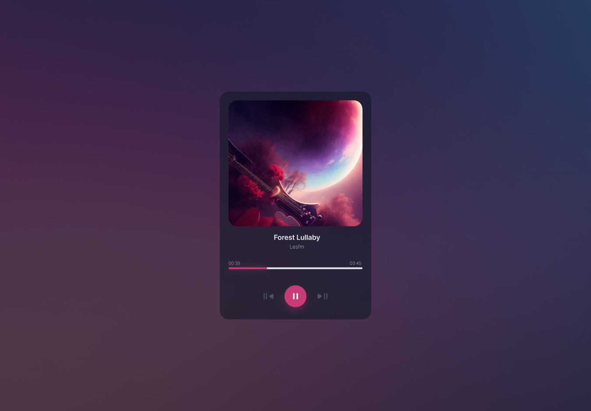

<!-- Please update value in the {}  -->

<h1 align="center">MUSIC PLAYER | devChallenges</h1>

   Solution for a challenge <a href="https://devchallenges.io/challenge/music-player" target="_blank">Music Player
</a> from <a href="http://devchallenges.io" target="_blank">devChallenges.io</a>.

  <h3>
    <a href="https://music-player-devch.netlify.app/">
      Demo
    </a>
     | 
    <a href="https://github.com/Alyyyy88/Music-player">
      Solution
    </a>
     | 
    <a href="https://devchallenges.io/challenge/music-player">
      Challenge
    </a>
  </h3>

## Table of Contents

- [Overview](#overview)
- [Built with](#built-with)
- [Features](#features)

## Overview

### Built with

- Semantic HTML5 markup
- CSS custom properties
- Flexbox
- CSS Grid
- vanilla JS
- Audio API

## Features

This application/site was created as a submission to a [DevChallenges](https://devchallenges.io/challenges-dashboard) challenge.

## Author

- GitHub [@Alyyyy88](https://github.com/Alyyyy88})
